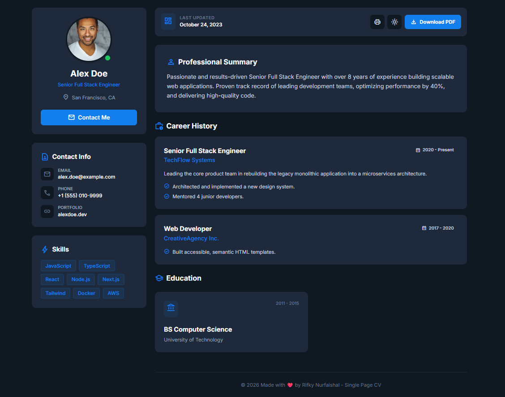

# Single Page CV

This is a solution to the [Single Page CV](https://roadmap.sh/projects/single-page-cv) challenge on roadmap.sh.

## 📸 Preview

## 🚀 Features

- **Semantic HTML**: Built with accessibility and SEO best practices.
- **Responsive Design**: Fully responsive layout using Tailwind CSS grid and flexbox.
- **Dark Mode**: Includes a theme toggle with state persistence (saves preference in LocalStorage).
- **Print Optimization**: Custom `@media print` styles to ensure a clean layout when printing to PDF (Ctrl+P).
- **Clean Architecture**: separated HTML, CSS, and JavaScript files.

## 🛠️ Tech Stack

- **HTML5** (Semantic Structure)
- **Tailwind CSS** (via CDN for styling)
- **Vanilla JavaScript** (DOM Manipulation & Logic)

## 📦 How to Run

1. Clone this repository.
2. Open `index.html` in your browser.
3. Use the toggle button to switch themes or the print button to generate a PDF.

## 🔗 Project Link

https://roadmap.sh/projects/single-page-cv
